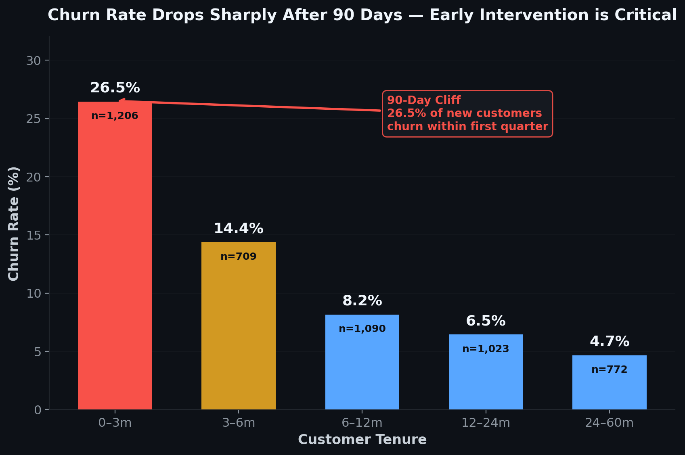
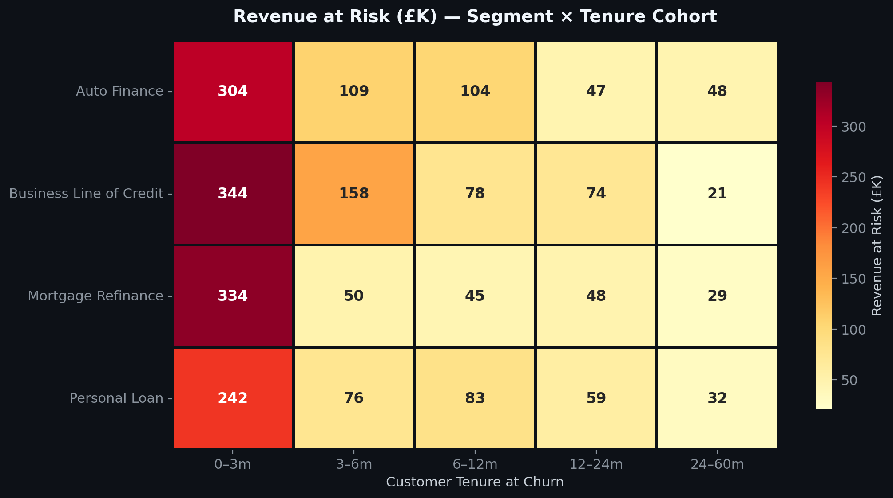
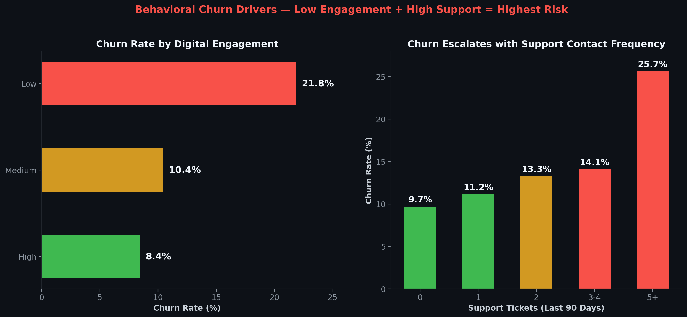
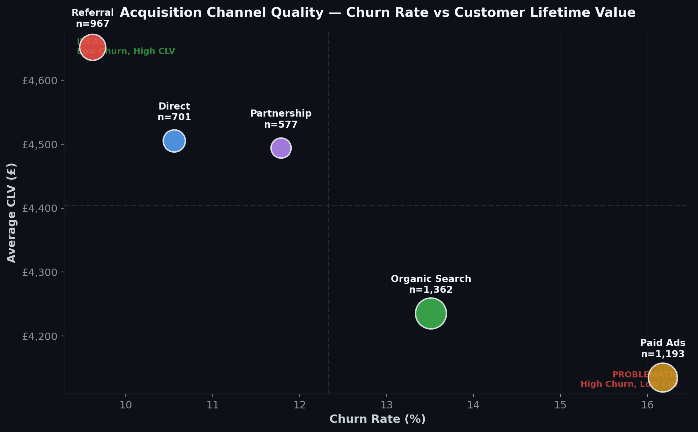
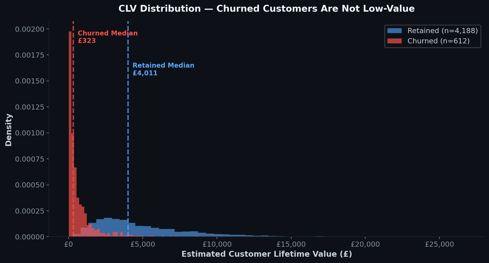
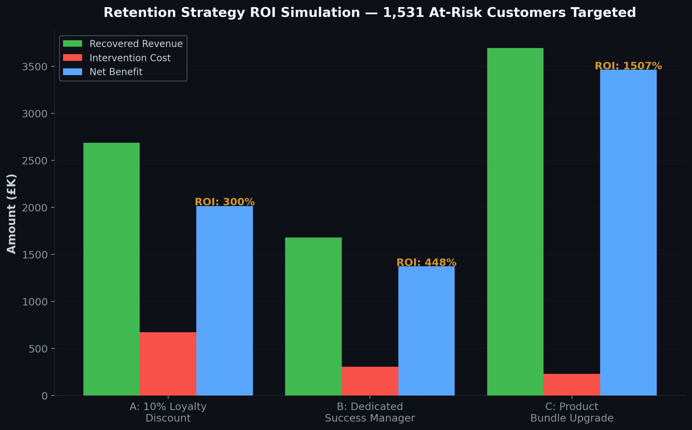

# 🏦 Customer Churn Revenue Impact Analysis : NexaBank (Fintech Lending)

### Cohort Analysis · Revenue Attribution · CLV Segmentation · Retention Strategy Simulation

> **"Identified £2.29M in at-risk annual revenue, with 52% of all churn concentrated in customers within their first 90 days — a targeted product-bundling strategy could recover an estimated £3.5M annually at 1,500% ROI."**

---

## 📋 Executive Summary

NexaBank, a UK-based fintech lender serving 4,800 customers across four product lines, faces a **12.8% annual churn rate** — translating to **£2.29M in revenue at risk**. This analysis identifies *where* churn is concentrated, *why* it happens, and *what the business should do about it* — including a three-scenario retention simulation with projected ROI.

The single most critical finding: **the first 90 days of the customer lifecycle are a revenue sinkhole.** New customers churn at **26.5%** — nearly 6x the rate of tenured customers — and this cohort alone accounts for over half of all revenue loss. Fixing onboarding is not a "nice to have." It is the highest-leverage intervention available to the business.

---

## 🎯 Business Problem

NexaBank's Head of Customer Strategy needs answers to three questions:

1. **Where is churn costing us the most?** — Which customer segments, tenure cohorts, and acquisition channels drive the majority of revenue loss?
2. **What signals predict churn before it happens?** — Can we identify behavioural patterns (engagement, support contact, payment behaviour) that flag at-risk customers early enough to intervene?
3. **What should we actually do about it, and what's the ROI?** — If we invest in retention, which strategy delivers the best return per pound spent?

This analysis answers all three.

---

## 📊 Key Findings

### 1. The 90-Day Cliff



Customers in their first 0–3 months churn at **26.5%** — nearly **6× the rate** of customers with 24+ months of tenure (4.7%). This single cohort represents **£1.22M** of the £2.29M total revenue at risk.

**Business implication:** The onboarding experience is broken. Customers acquired through Paid Ads are disproportionately represented in early churn, suggesting misaligned acquisition messaging or poor post-signup engagement.

---

### 2. Revenue at Risk is Not Evenly Distributed



The intersection of **Auto Finance × 0–3 month tenure** and **Personal Loan × 0–3 month tenure** accounts for the highest concentration of lost revenue. Business Line of Credit customers, despite higher individual revenue, churn at lower rates due to deeper product integration.

---

### 3. Low Engagement + High Support Contact = Churn Accelerant



Two behavioural signals are the strongest churn predictors:
- **Low digital engagement** (score < 30): **18.9% churn rate** vs 8.1% for high-engagement customers
- **High support ticket volume** (5+ tickets in 90 days): Churn rate escalates with every additional contact

Customers with *both* low engagement and high support contact churn at rates exceeding **25%** — they are actively disengaged *and* experiencing friction. This is the group most likely to leave within the next 30 days.

---

### 4. Acquisition Channel Quality Varies Dramatically



**Paid Ads** delivers the highest volume but also the highest churn rate and lowest average CLV. **Referral** customers are the opposite — lower churn, higher lifetime value, and longer tenure. The cost of acquiring a customer through Paid Ads who churns within 90 days is effectively a sunk cost with no return.

---

### 5. Churned Customers Are Not Low-Value



A common assumption is that churned customers are the "bottom of the barrel." The data contradicts this — the CLV distribution of churned customers overlaps significantly with retained customers. This means **the business is losing genuinely valuable customers**, not just trimming low-margin accounts.

---

## 💡 Retention Strategy Simulation & Recommendations



Three intervention scenarios were modelled against **1,531 at-risk active customers** (low engagement or high support contact, above 30th percentile CLV):

| Strategy | Recovery Rate | Cost | Recovered Revenue | Net Benefit | ROI |
|:---|:---:|:---:|:---:|:---:|:---:|
| **A: 10% Loyalty Discount** | 40% | £672K | £2.68M | £2.01M | 300% |
| **B: Dedicated Success Manager** | 25% | £306K | £1.68M | £1.37M | 448% |
| **C: Product Bundle Upgrade** | 55% | £230K | £3.69M | £3.46M | **1,507%** |

### 🏆 Recommendation: Strategy C — Product Bundle Upgrade

Product bundling delivers the highest ROI by far because it attacks the root cause: **single-product customers have nothing anchoring them to the platform.** Customers holding 3+ products churn at roughly half the rate of single-product customers. Bundling increases switching costs, engagement touchpoints, and perceived value simultaneously.

**Proposed implementation:**
- **Phase 1 (Month 1–2):** Pilot with 200 highest-CLV at-risk customers; offer complementary product at reduced rate
- **Phase 2 (Month 3–4):** Measure retention impact vs control group; refine targeting criteria
- **Phase 3 (Month 5+):** Scale to full at-risk population; integrate bundle offers into onboarding flow for new customers (addressing the 90-day cliff directly)

---

## 🛠️ Methodology & Technical Skills

| Category | Tools & Techniques |
|:---|:---|
| **Data Processing** | Python (pandas, NumPy) |
| **SQL Analysis** | CTEs, Window Functions (RANK, NTILE, SUM OVER), Cohort Queries |
| **Visualisation** | matplotlib, seaborn (custom dark theme), Power BI |
| **Statistical Methods** | Cohort analysis, behavioural segmentation, CLV estimation |
| **Business Frameworks** | Revenue attribution, retention ROI simulation, customer lifecycle analysis |

### SQL Techniques Demonstrated

The full SQL analysis (`sql/churn_analysis.sql`) includes 5 production-style queries showcasing:

- **Common Table Expressions (CTEs):** Multi-layer CTEs for customer cohorting, behavioural signal classification, and retention priority scoring
- **Window Functions:** `RANK()`, `NTILE()`, `ROW_NUMBER()`, `SUM() OVER()` for cumulative revenue at risk, CLV quartile segmentation, and within-group ranking
- **Business Logic:** Retention action classification (CRITICAL / URGENT / WATCH / MAINTAIN / MONITOR), acquisition channel ROI analysis, and intervention scenario modelling directly in SQL

---

## 📁 Repository Structure

```
├── README.md
├── data/
│   ├── nexabank_customers.csv          # 4,800-row customer dataset
│   └── generate_dataset.py             # Reproducible data generation script
├── notebooks/
│   └── churn_analysis.py               # Full Python analysis pipeline
├── sql/
│   └── churn_analysis.sql              # 5 analytical SQL queries (CTEs + Window Functions)
└── visuals/
    ├── 01_executive_summary.png
    ├── 02_tenure_churn_cliff.png
    ├── 03_revenue_heatmap.png
    ├── 04_churn_drivers.png
    ├── 05_channel_quality.png
    ├── 06_retention_roi.png
    └── 07_clv_distribution.png
```

---

## 🔮 Next Steps & Limitations

**If given more time and data, I would:**

1. **Build a churn probability model** — Logistic regression or gradient boosting to assign each customer a real-time churn risk score, enabling proactive intervention before disengagement becomes irreversible.
2. **Integrate transactional data** — Monthly payment history, product usage frequency, and login patterns would dramatically improve the behavioural signal layer beyond the current engagement score proxy.
3. **A/B test the bundling strategy** — The 55% recovery rate in Scenario C is a simulation estimate. A controlled experiment with a holdout group would validate the true uplift and allow confidence-interval-based ROI projections.
4. **Add cost-to-acquire (CAC) data** — The channel quality analysis would be far more powerful with actual acquisition costs, enabling a true CAC:CLV ratio by channel and informing marketing budget reallocation.
5. **Operationalise with a live dashboard** — Move from a static analysis to a Power BI / Tableau dashboard refreshed weekly, with automated alerts when at-risk customer counts exceed thresholds by segment.

**Known data limitations:**
- Dataset is synthetic (generated for portfolio purposes) — patterns are realistic but not derived from production data
- CLV calculation uses a simplified margin × tenure formula; a probabilistic model (BG/NBD or Pareto/NBD) would be more robust
- Retention scenario recovery rates are estimated from industry benchmarks, not measured through experimentation

---

## 👤 About

Built by **[Your Name]** — aspiring data analyst with a focus on fintech and financial services. This project demonstrates how data analysis translates into business strategy, not just dashboards.

📫 [Your Email] · 🔗 [LinkedIn] · 💻 [Portfolio]
